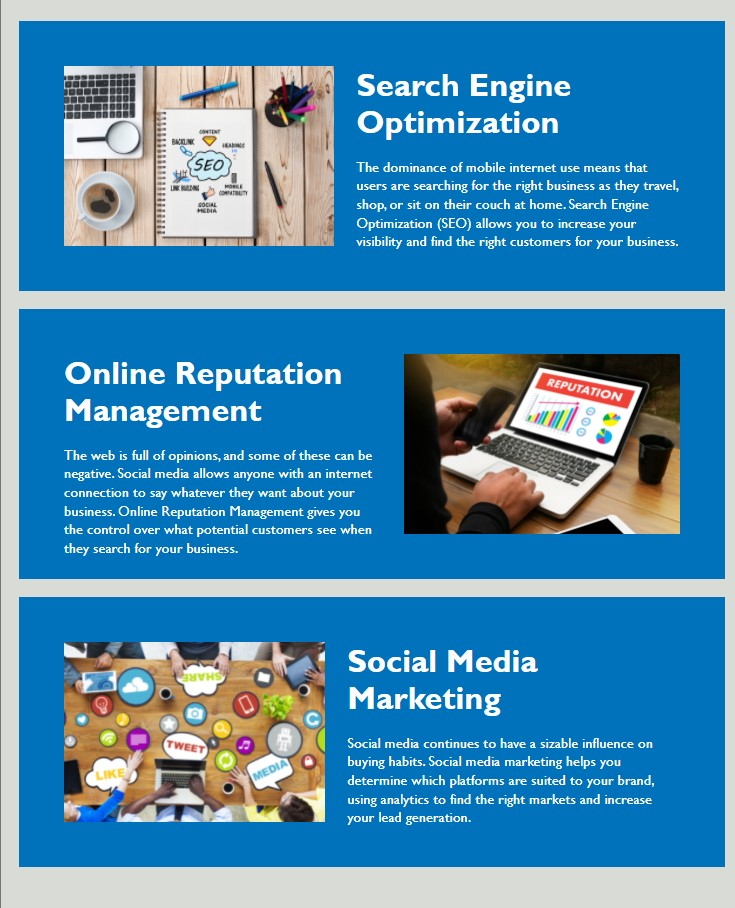
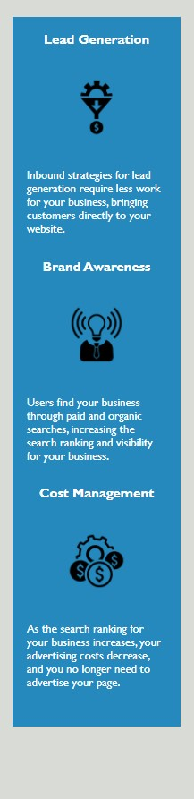

# Code Refactor Starter Code

The purpose of this project is to refactor the codebase of the Horiseon landing page so that it meets accessibility standards and is optimised for search engines.

## Goals

Both goals were achieved by the following methods:
 
1. by ensuring that all images have <alt> tags.  
2. by substituting semantic HTML elements such as section, nav, header and footer for numerous, non-descriptive div elements  
3. by ensuring that all links worked efficiently  
4. by consolidating and reorganizing CSS sectors and properties  
5. by including comments before each element or section of the page  

## Technologies

The primary technologies used were:
1. Visual Studio to create HTML and CSS files
2. Git Bash command line interface 

## History

Header and Navigation  
1. Used the semantic 'header' tag to demarcate the information at the very top of the page.  
2. Used 'nav' semantic element to differentiate and encapsulate the hypertext anchors and also ensured checked to make sure the IDs matched source and destination. 

  

 
Hero  
1. This presented a challenge because I couldn't find the source imaage, which was actually located in style.css as an svg file. I broke the page until I located and corrected it in the codebase.
  

 
 
Footer  
1. The footer was the simplest section to address, by substituting the semantic 'footer' for the more wordy elements previously used, minimizing the code.
  

 
Main content section  
1. I utilized semantic elements here as well by differentiating the parent 'section' from its 'div' children to make it easier to read and optimise searches.  
2. I utilized common 'class' and 'id' attributes to consolidate the code
3. I added 'alt' text to the images as an accessibility feature 
  

 
Lead generation section  
1. This section could have been called the 'secondary content' section, but I thought it was more important to specify the actual content.  
2. I used emplty 'alt' references so that the text reader would not waste time reading these icons. 

## Contributing

## Credits

The following resources were used to complete this projects:
1. UCONN Coding Bootcamp's modules on HTML and CSS
2. This article:  https://www.freecodecamp.org/news/how-to-write-a-good-readme-file/

## License

GPL 3.0-or later